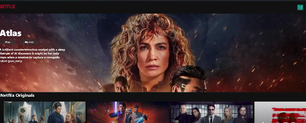

<div align="center">

# 🎬 REACT NETFLIX CLONE
### *Dynamic Media Discovery Application*

[](https://react.dev/)
[](https://axios-http.com/)
[](https://www.themoviedb.org/)

**A high-fidelity Netflix replica that fetches real-time trending data and movie details using the TMDB API.**
</div>

---

## 📖 Overview
This project is a functional clone of the Netflix landing page, focusing on seamless API integration and component reusability. It utilizes **Axios** for handling HTTP requests and displays content in a categorized "Row" format, mimicking the actual Netflix user experience.

---


## 📸 Preview



---


## ✨ Key Technical Features
* **🌐 Real-time Data:** Integrated with the **TMDB API** to fetch trending, top-rated, and genre-specific movie data.
* **🎥 Dynamic Hero Banner:** Displays a featured movie/show background with an auto-updating title and description.
* **📦 Component-Based UI:** Modular architecture with dedicated components for the Navbar, Banner, and RowPost.
* **🔄 Asynchronous Logic:** Efficiently handles API calls and state updates using React Hooks.

---

## 🏗️ Project Structure
The application is organized into logical modules for better maintainability:
- **`Components/`**: Contains UI logic for the Banner, Navbar, and categorized Rows.
- **`axios.js`**: Centralized Axios instance configuration with base URLs.
- **`constants/`**: Secure management of API keys and image base paths.
- **`urls.js`**: Organized endpoints for different movie categories.


---

## 💻 Tech Stack
| Layer | Technology |
| :--- | :--- |
| **Frontend Library** | React.js |
| **Data Fetching** | Axios |
| **Styling** | CSS3 (Component-level styling) |
| **API Provider** | TMDB (The Movie Database) |

---

## 🚦 Getting Started

### Prerequisites
* Node.js (v16+)
* A TMDB API Key (You can get one at [themoviedb.org](https://www.themoviedb.org/settings/api))

### Installation
1. **Clone the repository:**
   ```bash
   git clone [https://github.com/faizal08/REACT-NETFLIX-CLONE.git](https://github.com/faizal08/REACT-NETFLIX-CLONE.git)

2. Install dependencies:
```bash
npm install
```

3.Configure API:
Update your src/constants/constants.js with your TMDB API key and base URL.

4.Run the application:

```Bash
npm start
```
## 📧 Contact
- *Developer:* [Faizal](https://github.com/faizal08)
- *Email:* [reachfaizal08@gmail.com](mailto:reachfaizal08@gmail.com)
